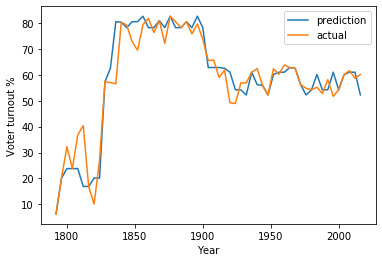

# Voter Turnout Predictions
Predicting voter turnout in US presidential and midterm elections given only the turnout of the previous presidential and midterm election. Uses decision tree regression and implemented in Jupyter Notebook.

### Accuracy
This model has an R^2 score of **0.74** using a test size of 65%.\
\
Prediction for 2020 presidential election: 62.5%\
Actual voter turnout for 2020 presidential election: Unknown at this time



### Running locally

Activate your virtual environment (if using one) then install packages
```
pip install -r requirements.txt
```

Change this line in the Jupyter Notebook
```
data = pd.read_csv(r'../data/VoterTurnout.csv')
```
To the path of `VoterTurnout.csv` on your system

### Discussion
The model seems to perform better when trying to predict for a year with higher voter turnout (such as the late 1800's). 
Similarly, it performs worse when trying to predict for a year with lower voter turnout (such as the late 1700's and early 1800's). At the very beginning of the
test data, it seems to overestimate jumps and drops in voter turnout. Perhaps this is due to the outlier nature of the beginning of the data set,
where voter turnout was significantly low. A possible fix could be to introduce features that would allow each year to have access to voter turnout data from the last n elections. Of course, this would mean that the first n elections would also need to be removed from the data set.

### References
Data collected from http://www.electproject.org/national-1789-present
